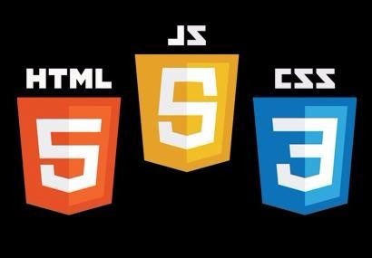
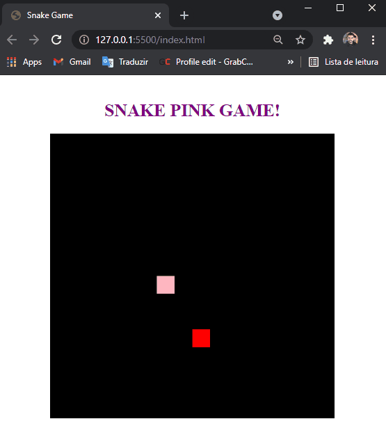

<h1 align="center">
  
   
  SNAKE PINK GAME!
</h1>

<h3 align="justify">
Application of the famous snake game made in JavaScript, HTML and CSS. Credits for the Labs PRO module of digital innovation one.
</h3>

 

## 📷 Demonstration

  

 

## 🚀 Technologies

This project was developed with the following technologies:

- JavaScript
- HTML
- CSS

 

## ⚙ Sources
- https://www.flaticon.com/br
- https://www.netlify.com/

 

## ⚙ Test

 

---

Made with 💜 by Rafael Maciel
